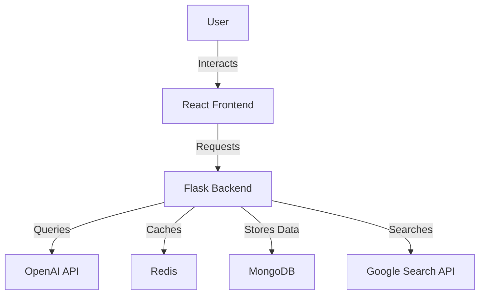
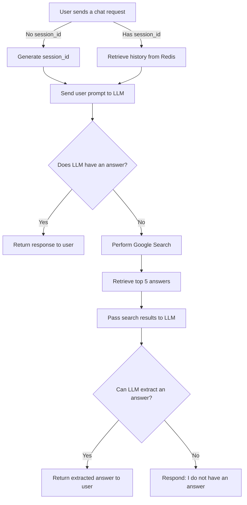

# ChatBot Application using OpenAI Completion API

## Index

1. [Description](#description)
2. [Architecture](#architecture)
3. [Workflow](#workflow)
4. [Flowchart](#flowchart)
5. [Technologies Used](#technologies-used)
6. [Configuration](#configuration)
7. [Local Installation Using Docker Compose](#local-installation-using-docker-compose)
8. [Stopping the Application](#stopping-the-application)
9. [Deployment](#deployment)
10. [Enhancements](#enhancements)

## Description

This project is a chatbot application leveraging GPT models using **OpenAI** or **Azure OpenAI**. It utilizes OpenAI's
Completion API to provide intelligent responses to user inputs. If the chatbot cannot answer a query confidently, it
performs an internet search using Google Search APIs and retrieves the top five relevant answers to provide a more
accurate response.

**💡 Hint:** Another approach utilizing the **function_calling** feature using the completion API checkout branch name `feature/function-call`.

## Architecture

The application is built on a three-tier architecture comprising the following components:



1. **Application Server (Backend)**:
    - Built using Flask API (Python)
    - Manages chat sessions and history
    - Integrates with OpenAI’s Completion API
    - Performs internet searches when necessary

2. **Frontend**:
    - Developed using React.js
    - Styled with Material UI
    - Communicates with the backend for chat interactions

3. **Storage & Session Management**:
    - **Redis**: Stores session-based temporary conversation history for quick retrieval
    - **MongoDB**: Persists chat logs using session IDs for long-term storage

## Workflow

1. **User initiates a chat request**:

    - If no `session_id` is provided in the request, the backend generates a new one.
    - The backend responds with the generated `session_id`, and the frontend continues using it for subsequent requests.

2. **Processing the user input**:

    - If a `session_id` exists, the backend retrieves the conversation history from Redis and appends the new user
      prompt.
    - The prompt and history are sent to OpenAI’s Completion API with specific behavior instructions.

3. **Handling unknown responses**:

    - If the model responds with "I do not know," the backend triggers a search using Google Search APIs.
    - The top five search results are retrieved and passed to the LLM for answer extraction.
    - If an answer is found, it is returned to the user; otherwise, the bot confirms it does not have an answer.

## Flowchart



## Technologies Used

- **Backend**: Flask (Python)
- **Frontend**: React.js, Material UI
- **Database**: MongoDB (for persistent storage)
- **Session Management**: Redis
- **AI Integration**: OpenAI Completion API (GPT models)
- **Search Engine**: Google Search APIs

## Configuration

To set up the project, configure the following environment variables:

```env
# OpenAI API
AZURE_OPENAI_API_KEY=your_openai_api_key
AZURE_OPENAI_ENDPOINT=your_azure_openai_endpoint

# Google Search API
GOOGLE_SEARCH_API_KEY=your_google_api_key
GOOGLE_SEARCH_CX=your_search_engine_id
```

Ensure that all dependencies are installed, and services like Redis and MongoDB are running before starting the
application.

## Local Installation Using Docker Compose

To run this chatbot application locally, follow these steps:

1. Install [Docker](https://www.docker.com/) and [Docker Compose](https://docs.docker.com/compose/install/).
2. Clone the repository and navigate to the project root.
3. Create a `.env` file by copying the `.env.example` and configure it with the necessary environment variables.
4. Run the following command to start all services:

   ```sh
   docker compose up --build
   ```

This will start all necessary services defined in the `docker-compose.yaml` file.

### Services in Docker Compose

The `docker-compose.yaml` file includes the following services:

- **API Server (`api-server`)**:
    - Runs the Flask-based chatbot backend.
    - Mounts backend code for live updates.
    - Exposes port `5000`.
    - Connects to MongoDB and Redis.

- **Frontend (`front-app`)**:
    - Runs the React.js front-end application.
    - Exposes port `3000`.

- **MongoDB (`mongo`)**:
    - Provides persistent storage for chat logs.
    - Exposes port `27017`.
    - Uses a named volume for data persistence.

- **Mongo Express (`mongo-admin`)**:
    - Web-based admin interface for MongoDB.
    - Exposes port `8081`.
    - Depends on the MongoDB service.

- **Redis (`redis`)**:
    - Caches session-based chat history.
    - Exposes port `6379`.
    - Uses a named volume for data persistence.

- **Redis Insight (`redis-insight`)**:
    - Web-based GUI tool for Redis management.
    - Exposes port `5540`.
    - Depends on Redis.

### Stopping the Application

To stop all running containers, use:

```sh
docker compose down
```

This will shut down all services and remove associated containers.

## Deployment
The deployment platform is **Kubernetes**, and all deployment scripts have been tested on **AWS EKS** with **Auto** mode enabled.

There are two deployment options:
- **Standalone deployment:** suitable for small environments like development and staging.
- **High-availability deployment:** which should be used for production.

### Standalone Deployment

1. Navigate to `deployment/standalone`
2. Build Frontend: Run `./build-front.sh dev` to build and push the frontend-app image to AWS ECR. You can modify the
   command to use any container registry of your choice.
3. Build Backend: Run `./build-backend.sh dev` to build and push the frontend-app image to AWS ECR. You can modify the
   command to use any container registry of your choice.
4. Update the placeholder `{app-image-uri}` in `app-deplyment.yaml`, and `frontend-deployment.yaml` with image uri and
   tag created on the prev steps for both apps. here is an example of image uri with tag of the frontend app
   `{aws-account-id}.dkr.ecr.us-east-1.amazonaws.com/chatbot/frontend:latest`
5. Crete the kubernetes cluster if not exist. or use the following command to create K8S cluster on AWS with the auto
   mode `eksctl create cluster --name=chatbot --enable-auto-mode`
6. Review the secrets in the `secrets.yaml` and update all placeholders with actual env variables.
7. Run `./deploy.sh` command to start provision all required resources.
8. Finally get available service urls using `kubectl get services -n chatbot-dev`
9. Note: All K8S resources will be created under namespace `chatbot-dev`, you can manage it from the .yaml files in the
   `deployment/standalone` folder.

### High Availability Deployment

The high availability setup utilize bitnami Helm charts for building a reliable Redis and Mongo DB clusters, also
handling the HPA on the frontend and api apps.

1. Navigate to `deployment/high-availability`
2. Build Frontend: Run `./build-front.sh prod` to build and push the frontend-app image to AWS ECR. You can modify the
   command to use any container registry of your choice. configure the backend host in this build script before running.
3. Build Backend: Run `./build-backend.sh prod` to build and push the frontend-app image to AWS ECR. You can modify the
   command to use any container registry of your choice.
4. Update the placeholder `{app-image-uri}` in `app-deplyment.yaml`, and `frontend-deployment.yaml` with image uri and
   tag created on the prev steps for both apps. here is an example of image uri with tag of the frontend app
   `{aws-account-id}.dkr.ecr.us-east-1.amazonaws.com/chatbot/frontend:latest`
5. Crete the kubernetes cluster if not exist. or use the following command to create K8S cluster on AWS with the auto
   mode `eksctl create cluster --name=chatbot --enable-auto-mode`
6. Review the secrets in the `secrets.yaml` and update all placeholders with actual env variables.
7. Run `./deploy.sh` command to start provision all required resources.
8. Finally get available service urls using `kubectl get services -n chatbot-prod`
9. Note: All K8S resources will be created under namespace `chatbot-prod`, you can manage it from the .yaml files in the
   `deployment/high-availability` folder.

## Enhancements

- Manage the conversation object efficiently to avoid exceeding the model's token
  limits. [resource](https://learn.microsoft.com/en-us/azure/ai-services/openai/how-to/chatgpt?tabs=python-new#manage-conversations)
