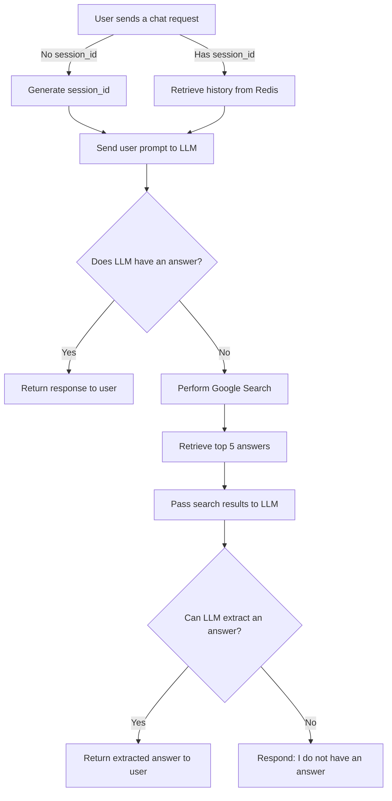

# ChatBot Application using OpenAI Completion API

## Description

This project is a chatbot application leveraging GPT models using **OpenAI** or **Azure OpenAI**. It utilizes OpenAI's Completion API to provide intelligent responses to user inputs. If the chatbot cannot answer a query confidently, it performs an internet search using Google Search APIs and retrieves the top five relevant answers to provide a more accurate response.

## Architecture

The application is built on a three-tier architecture comprising the following components:

1. **Application Server (Backend)**:

   - Built using Flask API (Python)
   - Manages chat sessions and history
   - Integrates with OpenAI’s Completion API
   - Performs internet searches when necessary

2. **Frontend**:

   - Developed using React.js
   - Styled with Material UI
   - Communicates with the backend for chat interactions

3. **Storage & Session Management**:

   - **Redis**: Stores session-based temporary conversation history for quick retrieval
   - **MongoDB**: Persists chat logs using session IDs for long-term storage

## Workflow

1. **User initiates a chat request**:

   - If no `session_id` is provided in the request, the backend generates a new one.
   - The backend responds with the generated `session_id`, and the frontend continues using it for subsequent requests.

2. **Processing the user input**:

   - If a `session_id` exists, the backend retrieves the conversation history from Redis and appends the new user prompt.
   - The prompt and history are sent to OpenAI’s Completion API with specific behavior instructions.

3. **Handling unknown responses**:

   - If the model responds with "I do not know," the backend triggers a search using Google Search APIs.
   - The top five search results are retrieved and passed to the LLM for answer extraction.
   - If an answer is found, it is returned to the user; otherwise, the bot confirms it does not have an answer.

## Flowchart



## Technologies Used

- **Backend**: Flask (Python)
- **Frontend**: React.js, Material UI
- **Database**: MongoDB (for persistent storage)
- **Session Management**: Redis
- **AI Integration**: OpenAI Completion API (GPT models)
- **Search Engine**: Google Search APIs

## Configuration

To set up the project, configure the following environment variables:

```env
# OpenAI API
OPENAI_API_KEY=your_openai_api_key
AZURE_OPENAI_API_KEY=your_azure_openai_api_key

# Google Search API
GOOGLE_SEARCH_API_KEY=your_google_api_key
GOOGLE_SEARCH_ENGINE_ID=your_search_engine_id
```

Ensure that all dependencies are installed, and services like Redis and MongoDB are running before starting the application.

## Local Installation Using Docker Compose

To run this chatbot application locally, follow these steps:

1. Install [Docker](https://www.docker.com/) and [Docker Compose](https://docs.docker.com/compose/install/).
2. Clone the repository and navigate to the project root.
3. Create a `.env` file by copying the `.env.example` and configure it with the necessary environment variables. 
4. Run the following command to start all services:
   
   ```sh
   docker compose up --build
   ```

This will start all necessary services defined in the `docker-compose.yaml` file.

### Services in Docker Compose

The `docker-compose.yaml` file includes the following services:

- **API Server (`api-server`)**: 
  - Runs the Flask-based chatbot backend.
  - Mounts backend code for live updates.
  - Exposes port `5000`.
  - Connects to MongoDB and Redis.

- **Frontend (`front-app`)**: 
  - Runs the React.js front-end application.
  - Exposes port `3000`.

- **MongoDB (`mongo`)**: 
  - Provides persistent storage for chat logs.
  - Exposes port `27017`.
  - Uses a named volume for data persistence.

- **Mongo Express (`mongo-admin`)**: 
  - Web-based admin interface for MongoDB.
  - Exposes port `8081`.
  - Depends on the MongoDB service.

- **Redis (`redis`)**: 
  - Caches session-based chat history.
  - Exposes port `6379`.
  - Uses a named volume for data persistence.

- **Redis Insight (`redis-insight`)**: 
  - Web-based GUI tool for Redis management.
  - Exposes port `5540`.
  - Depends on Redis.

### Stopping the Application

To stop all running containers, use:

```sh
docker-compose down
```

This will shut down all services and remove associated containers.

---
